## 收集的一些GAN网络

### 部分测试结果对比

> 说明：
>
> 1. 生成器基本结构都是卷积网络
> 2. 缩写含义：SN - 谱归一化（Spectral Normalization）；EMA - 权重滑动平均（Exponential Moving Average）
> 3. 训练数据集使用CASIA-maxpy-clean，去除单色图片

#### DCGAN + SN

|                          iter 3000                           |                          iter 5000                           |
| :----------------------------------------------------------: | :----------------------------------------------------------: |
| 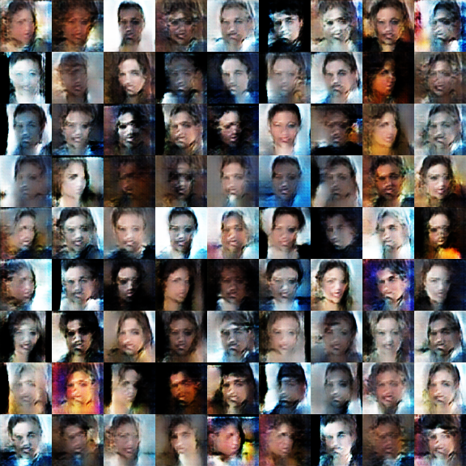 | 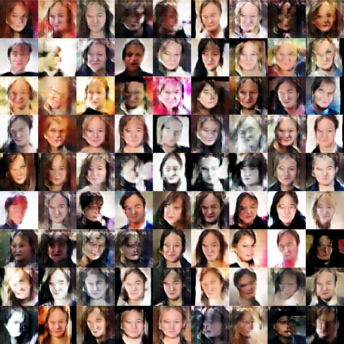 |

#### DCGAN + SN + 正则项

|                          iter 3000                           |                          iter 5000                           |
| :----------------------------------------------------------: | :----------------------------------------------------------: |
| 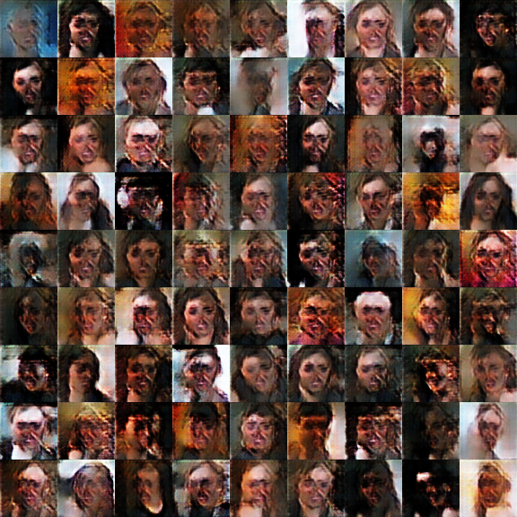 | 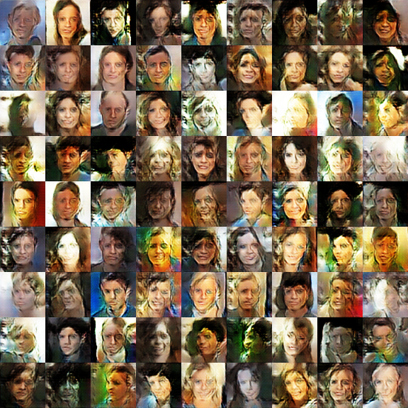 |

#### DCGAN + SN + EMA

|                          iter 3000                           |                          iter 5000                           |
| :----------------------------------------------------------: | :----------------------------------------------------------: |
| 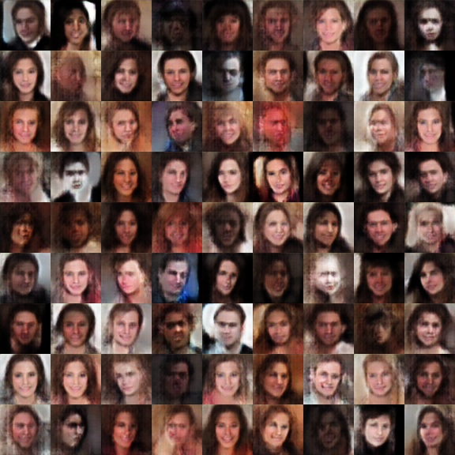 | 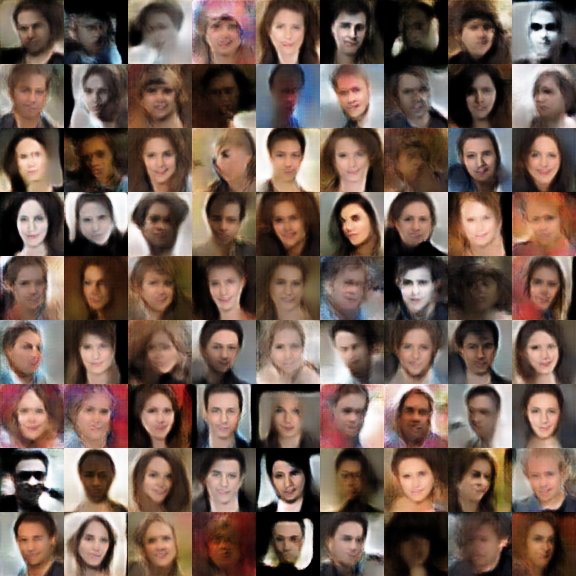 | 

#### DCGAN + SN + EMA + 正则项

|                          iter 3000                           |                          iter 5000                           |
| :----------------------------------------------------------: | :----------------------------------------------------------: |
| 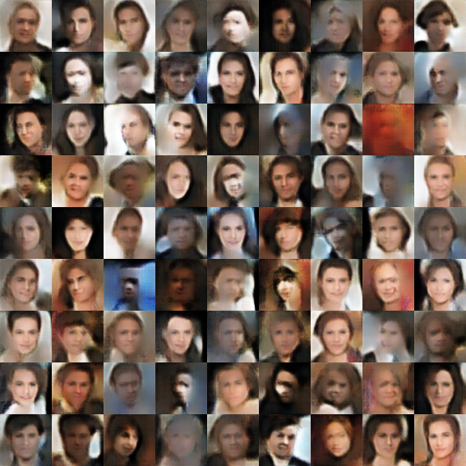 | 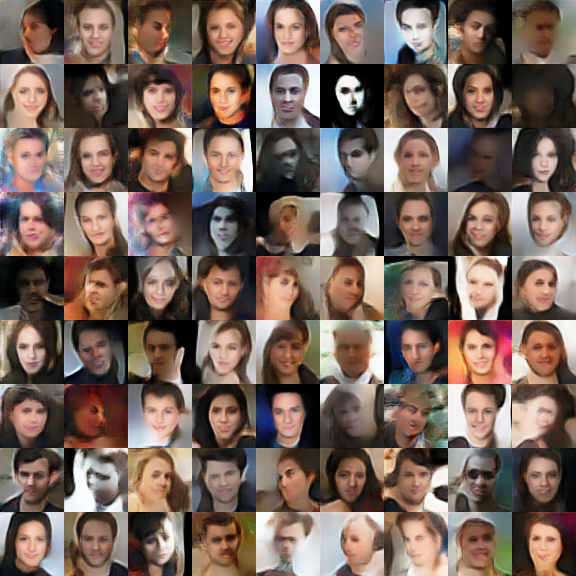 | 

#### RSGAN + SN

|                          iter 3000                           |                          iter 5000                           |
| :----------------------------------------------------------: | :----------------------------------------------------------: |
| 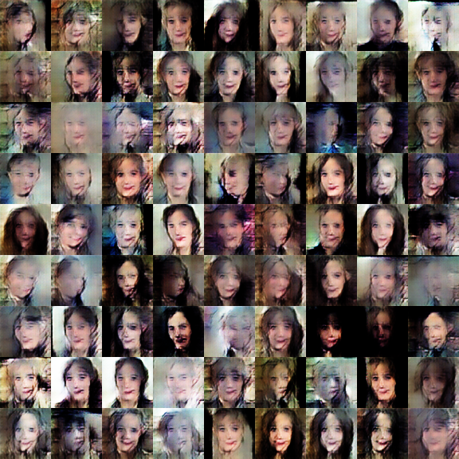 |  | 

#### WGAN + SN

|                          iter 3000                           |                          iter 5000                           |
| :----------------------------------------------------------: | :----------------------------------------------------------: |
| 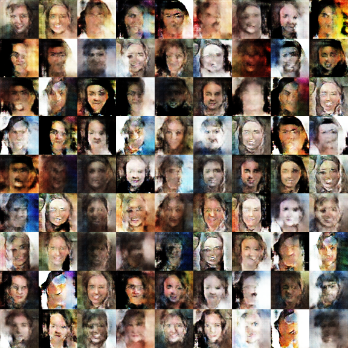 | 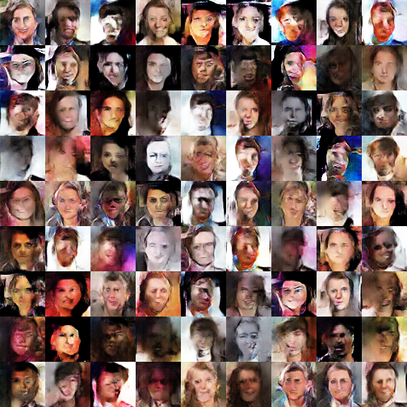 | 

#### WGAN-GP

|                          iter 3000                           |                          iter 5000                           |
| :----------------------------------------------------------: | :----------------------------------------------------------: |
| 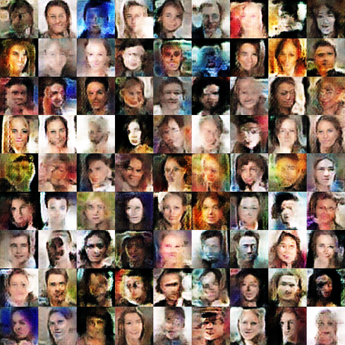 |  | 

#### WGAN-DIV

|                          iter 3000                           |                          iter 5000                           |
| :----------------------------------------------------------: | :----------------------------------------------------------: |
| 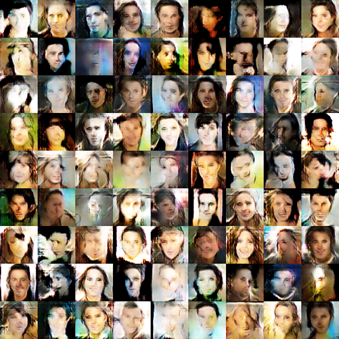 | 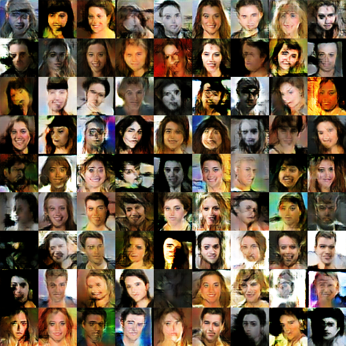 | 

#### GAN-QP + L1

|                          iter 3000                           |                          iter 5000                           |
| :----------------------------------------------------------: | :----------------------------------------------------------: |
| 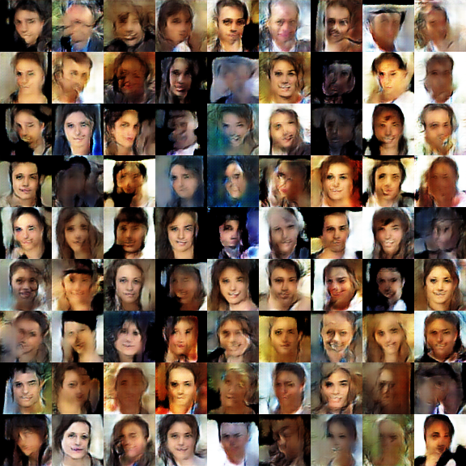 |  | 

#### GAN-QP + L1 + EMA

|                          iter 3000                           |                          iter 5000                           |
| :----------------------------------------------------------: | :----------------------------------------------------------: |
| 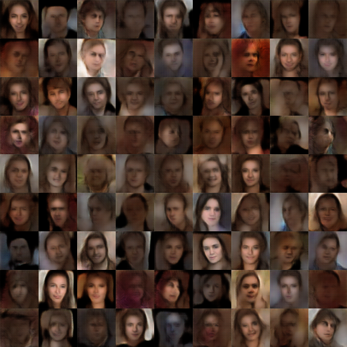 | 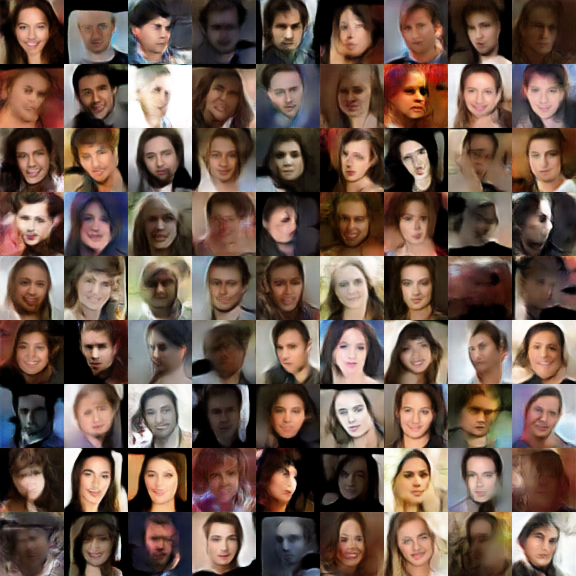 | 

#### GAN-QP + L2

|                          iter 3000                           |                          iter 5000                           |
| :----------------------------------------------------------: | :----------------------------------------------------------: |
|  | 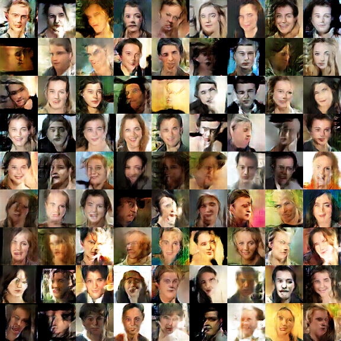 | 

#### GAN-QP + L2 + EMA

|                          iter 3000                           |                          iter 5000                           |
| :----------------------------------------------------------: | :----------------------------------------------------------: |
| 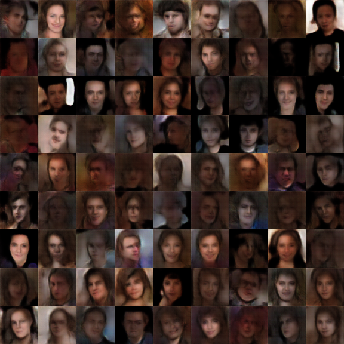 | 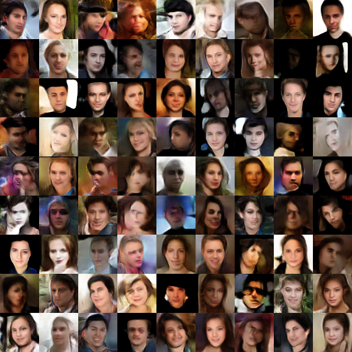 | 


### 在Keras 2.3.1使用权重滑动平均（EMA）的patch

```diff
diff --git a/keras/engine/training.py b/keras/engine/training.py
index 0a556f21..1a9a374e 100644
--- a/keras/engine/training.py
+++ b/keras/engine/training.py
@@ -328,7 +328,7 @@ class Model(Network):
                 self.train_function = K.function(
                     inputs,
                     [self.total_loss] + metrics_tensors,
-                    updates=updates + metrics_updates,
+                    updates=updates + metrics_updates + (self._other_metrics if hasattr(self, '_other_metrics') else []),
                     name='train_function',
                     **self._function_kwargs)
```

EMA的实现见```keras/utils.py```中```ExponentialMovingAverage```。使用EMA的例子见```keras/dcgan_sn_ema.py```。


### 原始代码来源

[1]: https://github.com/bojone/gan	"https://github.com/bojone/gan"
[2]: https://github.com/eriklindernoren/Keras-GAN	"https://github.com/eriklindernoren/Keras-GAN"
